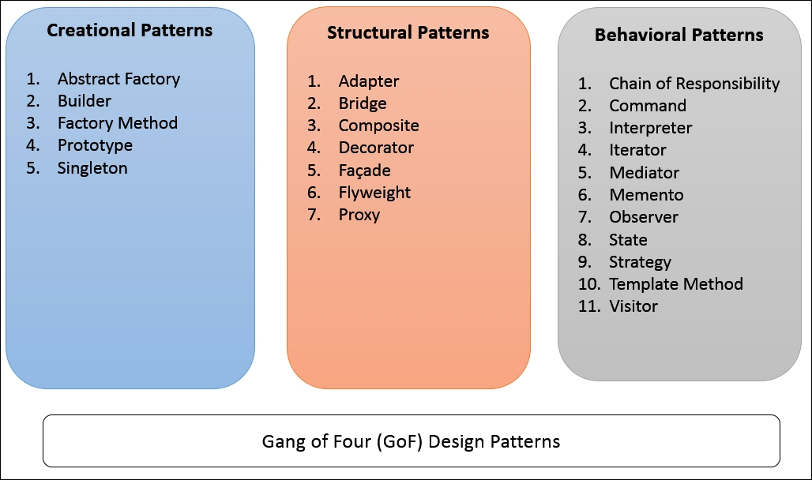

# Design Patterns

Design patterns provide solutions to common software design problems. 
In the case of object-oriented programming, design patterns are generally aimed at solving the problems of object generation and interaction, 
rather than the larger scale problems of overall software architecture. 
They give generalised solutions in the form of templates that may be applied to real-world problems.

## Creational

- **Abstract Factory** 
    Abstract Factory patterns work around a super-factory which creates other factories. 
    This factory is also called as factory of factories.
- **Builder** 
    Builder pattern builds a complex object using simple objects and using a step by step approach.
- **Factory Method** 
    In Factory pattern, we create object without exposing the creation logic to the client and refer to 
    newly created object using a common interface.
- **Prototype** 
    This pattern involves implementing a prototype interface which tells to create a clone of the current object. 
    This pattern is used when creation of object directly is costly. 
    For example, an object is to be created after a costly database operation. 
    We can cache the object, returns its clone on next request and update the database as and when needed thus reducing database calls.
- **Singleton** 
    This pattern involves a single class which is responsible to create an object while making sure that only single object gets created. 
    This class provides a way to access its only object which can be accessed directly without need to instantiate the object of the class.

## Structural

- **Adapter** 
- **Bridge** 
- **Composite** 
- **Decorator** 
- **Facade** 
- **Flyweight** 
- **Proxy** 

## Behavioral

